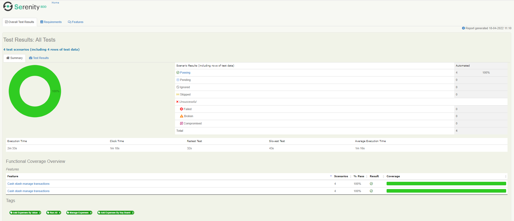

# :tada: **mobile-E2E-appium-java** :tada:


> This project attempts to automate a mobile application using Appium, Gradle and Java.

## **Prerequisites**

You need to have previously installed the following tools

[](https://gradle.org/install/)
[](https://www.java.com/es/)
[](https://appium.io/)

Download and install the app to automate :point_right: [Here!](https://apkcombo.com/es/cashstash-expense-manager-budget-tracker/com.slickteck.budget.tracker/) :point_left:

> ## **Table of Contents**

- [transfer-be-automation-tests-sp](#Module-or-Project-name)
- [Table of Contents](#Table-of-Contents)
- [Requirements](#Requirements)
- [The project directory structure](#The-project-directory-structure)
- [Inputs](#Inputs)
- [Tags](#Tags)
- [Installation](#Installation)
- [Example usage](#Example-usage)
- [ used technology stack  ](#Further-Reading--Useful-Links)

## **Requirements**

| Name      | Version |  
| --------- | ------- |  
| gradle |  \>= 6.9.x |  
| java | > = 1.11.x |  
| cucumber | > = 4.x |  
| serenity | > = 2.4.x |  
| appium | > = 1.x |  

## **The project directory structure**

? The project is compiled for Gradle and follows the standard directory structure used in most Serenity projects by
implementing the screenplay design pattern:

```Gherkin
src
+ main                                  | Location of automation source files
  + java
    + mobile.e2e.appium
      + constants                       | The constants to be used during automation are stored
      + models                          | Java objects used throughout automation are hosted
      + questions                       | The classes used to perform the test validations are hosted
      + tasks                           | The classes where the actions are carried out to comply with the HU raised are hosted
      + utils                           | Reusable resources are hosted by other classes (traversal classes)
  + resources                           | Multimedia files, .json files among other files are hosted
+ test                                  | The tests of each component reside in the application
  + java
    + mobile.e2e.appium
      + actors                          | Definition of the actor to be used during the execution life cycle
      + runners                         | Defines the characteristics that the execution of the tests will have
      + step_definitions                 | Contains the mapped steps from the test scenario definition files .feature
  + resources                           | The test case definition files .feature and the serenity.conf configuration files are hosted
    + features                          | Contains files with extension .feature
      + {feature_name}.feature          | Documents containing scripts written in the Gherkin language
    + serenity.conf                     | This file is used to configure test run options
```

## **Inputs**

| Name | Description | Values  |  
| ------------------ | -------------------------- |---------|  
| environment |Choose the operating system to run   | web app |

## **Outputs**

| Name               | Description                |  
| ------------------ | -------------------------- |  
| serenity reports   |   native and descriptive reports on the final state of the tests, the test results will be recorded in the target/site/serenity directory open the index.html file |

> An example of the report bellow:




## **Installation**

We use [Gradle](http://www.gradle.org), a cross-platform build automation tool that help with our full development
flow. If you prefer [install Gradle](http://www.gradle.org/installation) or use
a [Gradle wrapper](http://www.gradle.org/docs/current/userguide/gradle_wrapper.html) inside this project. 

* `git clone  https://github.com/athan3350/mobile-E2E-appium-java-ch.git` this repository
* change into the new directory `cd mobile-E2E-appium-java-ch`.

```bash  
 gradle clean test aggregate --no-build-cache -Denvironment=web_app
```

## **Tags**

The tags used during automation were the following

| Tag Name               | Description                |  
| ------------------ | -------------------------- |  
| @runAll   |  Run all scenarios  |
| @EUSuccess   |  Validate we can access to the EU web page  |

## **used technology stack**

* [MarkDown guide](https://www.markdownguide.org/getting-started/)
* [Screenplay Pattern](https://serenity-js.org/handbook/thinking-in-serenity-js/screenplay-pattern.html)
* [Gradle](https://gradle.org/install/)
* [JDK (Java Development Kit)](https://www.oracle.com/java/technologies/javase-downloads.html)
* [SonarQube](https://www.sonarqube.org/)
* [Serenity](http://www.thucydides.info/#/)
* [BDD (Behavior-Driven Development)](http://www.thucydides.info/#/)
* [Cucumber](https://cucumber.io/)
* [Gherkin](https://cucumber.io/docs/gherkin/)

> Authors:  
> **Sebastian Suarez**
> That's it, I hope you like it :sunglasses::metal: